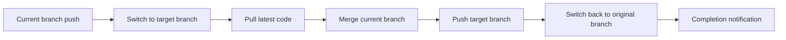
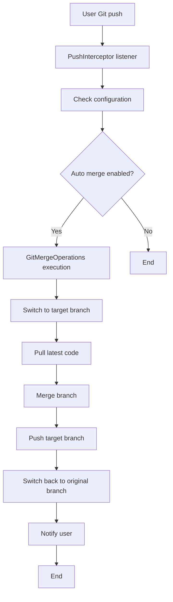
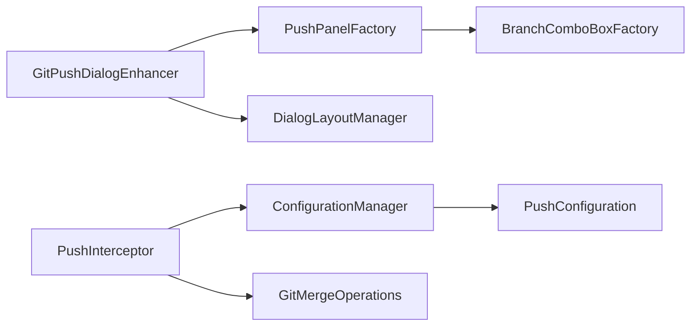

# GitMergeFlow

<div align="center">


**🔀 Intelligent Git Branch Merging Tool - Simplify Code Merging**

[](https://github.com/yanxianchao/gitmergeflow/stargazers)
[](https://github.com/yanxianchao/gitmergeflow/network)
[](https://github.com/yanxianchao/gitmergeflow/issues)
[](https://github.com/yanxianchao/gitmergeflow/releases)

[🌐 Language / 语言 / 語言](#-language-selection) • [Features](#-features) • [Quick Start](#-quick-start) • [User Guide](#-user-guide) • [Development](#-development) • [Contributing](#-contributing)

</div>

---

## 🌐 Language Selection

| 🇨🇳 简体中文 | 🇹🇼 繁體中文 | 🇺🇸 English |
|-------------|-------------|-------------|
| [简体中文](README.md) | [繁體中文](README.zh-TW.md) | **Current Document** |

> 💡 **Tip**: You can find all language versions in the project root directory, or visit the [Language Selection Page](README.lang.md) for the complete list.

---

## 📖 About

GitMergeFlow is an intelligent Git branch merging plugin designed specifically for IntelliJ IDEA, aimed at solving code synchronization challenges in multi-project development environments. In traditional development workflows, multiple feature branches require manual merging to common branches for deployment - a process that is tedious and error-prone.

GitMergeFlow achieves **one-click automatic merging** by integrating intelligent merging functionality into the Git push dialog, significantly improving development efficiency, reducing human errors, and allowing developers to focus on core business logic implementation.

### 🎯 Core Problems Solved

- **🔄 Repetitive Merging Work**: Eliminate manual operations of merging multiple branches to common branches
- **⚡ Low Deployment Efficiency**: Automate merging process, significantly shorten code deployment cycles
- **🛡️ Merge Conflict Risks**: Intelligently detect and handle merge conflicts, reducing code integration risks
- **📊 Multi-project Collaboration**: Unify merging process, standardize team development practices

---

## ✨ Features

### 🚀 Core Features

| Feature | Description | Benefits |
|---------|-------------|----------|
| **🤖 Smart Auto Merge** | Automatically merge to target branch after push | No manual operations, reduce human errors |
| **🎛️ Visual Configuration** | Configure target branch directly in push dialog | Intuitive operation, simple configuration |
| **🔀 Smart Branch Detection** | Automatically get available branch list | Avoid branch name errors |
| **⚡ Fast-Forward Merge Optimization** | Prioritize fast-forward merge for efficiency | Reduce unnecessary merge operations |
| **🔔 Real-time Status Feedback** | Detailed operation result notifications | Stay informed about merge status |
| **🛡️ Conflict Handling** | Intelligently detect merge conflicts and alert | Safe and reliable merge process |

### 🎨 User Experience

- **🎯 Seamless Integration**: Perfectly integrates with IntelliJ IDEA's native Git workflow
- **📱 Responsive Interface**: Adapts to different IDEA themes and screen sizes
- **⌨️ Quick Operations**: Support keyboard shortcuts for improved efficiency
- **🔒 Persistent Configuration**: Project-level configuration with intelligent user preference memory

---

## 🚀 Quick Start

### 📋 System Requirements

| Requirement | Version | Description |
|-------------|---------|-------------|
| **IntelliJ IDEA** | 2024.1+ | Supports Community and Ultimate editions |
| **Java** | 17+ | Runtime environment requirement |
| **Git** | 2.0+ | Version control tool |
| **Operating System** | Windows/macOS/Linux | Cross-platform support |

### 💻 Installation Methods

#### Method 1: Install from Plugin Marketplace (Recommended)

1. Open IntelliJ IDEA
2. Go to `File` → `Settings` → `Plugins`
3. Search for "GitMergeFlow"
4. Click `Install` to install the plugin
5. Restart IDEA

#### Method 2: Manual Installation

1. Download the latest plugin file:
   ```bash
   wget https://github.com/yanxianchao/gitmergeflow/releases/latest/download/GitMergeFlow.zip
   ```

2. Install in IDEA:
   - `File` → `Settings` → `Plugins` → `⚙️` → `Install Plugin from Disk...`
   - Select the downloaded zip file
   - Restart IDEA

#### Method 3: Developer Installation

```bash
# Clone repository
git clone https://github.com/yanxianchao/gitmergeflow.git
cd gitmergeflow

# Build plugin
./gradlew build

# Install to local IDEA
./gradlew runIde
```

---

## 📖 User Guide

### 🎯 Basic Usage Flow

#### 1. Enable Auto Merge Feature

In the Git push dialog, you'll see the new "Push to Branch" option:

```
┌─ Push Commits to origin/feature/user-auth ─────────────────────┐
│                                                               │
│ ☑️ Push commits                                               │
│                                                               │
│ ☑️ Push to branch: [develop ▼]                               │
│                                                               │
│                    [ Push ]  [ Cancel ]                      │
└───────────────────────────────────────────────────────────────┘
```

#### 2. Select Target Branch

- Check the "Push to branch" checkbox
- Select target branch from dropdown (e.g., `develop`, `staging`, `main`)
- Click `Push` button

#### 3. Automatic Merge Execution

The plugin will automatically execute the following operations:



### 🔧 Advanced Features

#### Fast-Forward Merge Optimization

When the target branch has no new commits, the plugin automatically uses fast-forward merge:

```bash
# Regular merge (requires branch switching)
git checkout develop
git pull origin develop
git merge feature/user-auth
git push origin develop
git checkout feature/user-auth

# Fast-forward merge (no branch switching required)
git push origin feature/user-auth:develop
```

#### Conflict Handling

When merge conflicts are detected, the plugin will:

1. **Stop automatic operations**: Avoid destructive operations
2. **Show detailed alerts**: Inform users about conflict information
3. **Maintain current state**: Don't automatically switch branches for manual resolution

```java
// Conflict alert example
"Conflict occurred when merging branch 'feature/user-auth' to 'develop', please resolve conflicts manually and continue"
```

### 📊 Configuration Management

#### Project-level Configuration

Each project's configuration is stored independently, supporting:

- **Enable/Disable**: Control auto merge feature per project
- **Target Branch**: Set different target branches for each project
- **Persistent Configuration**: Configuration remains after IDEA restart

#### Configuration File Location

```
# IDEA configuration directory
~/Library/Application Support/JetBrains/IntelliJIdea2024.1/options/
└── gitmergeflow.xml
```

---

## 🛠️ Development

### 📁 Project Structure

```
gitmergeflow/
├───src/
│   └───main/
│       ├───java/
│       │   └───com/github/yanxianchao/gitmergeflow/
│       │       ├───config/          # Configuration management
│       │       │   ├───ConfigurationManager.java
│       │       │   └───PushConfiguration.java
│       │       ├───git/             # Git operations core
│       │       │   └───GitMergeOperations.java
│       │       ├───launcher/        # Plugin launcher
│       │       │   └───GitMergeFlowLauncher.java
│       │       ├───listeners/       # Event listeners
│       │       │   └───PushInterceptor.java
│       │       ├───ui/              # User interface
│       │       │   ├───BranchComboBoxFactory.java
│       │       │   ├───DialogLayoutManager.java
│       │       │   ├───GitPushDialogEnhancer.java
│       │       │   └───PushPanelFactory.java
│       │       └───utils/           # Utility classes
│       │           └───ProjectResolver.java
│       └───resources/
│           └───META-INF/
│               └───plugin.xml       # Plugin description file
├───build.gradle                    # Build configuration
├───gradle.properties              # Gradle properties
└───README.md                      # Project documentation
```

### 🔧 Core Architecture

#### Event-Driven Architecture



#### Component Interactions



### 🧪 Build and Test

#### Local Development Environment

```bash
# 1. Clone project
git clone https://github.com/yanxianchao/gitmergeflow.git
cd gitmergeflow

# 2. Install dependencies
./gradlew build

# 3. Run tests
./gradlew test

# 4. Start debug environment
./gradlew runIde
```

#### Build Release Version

```bash
# Clean build
./gradlew clean

# Build plugin package
./gradlew buildPlugin

# Generated plugin location
# build/distributions/GitMergeFlow-1.0.0.zip
```

#### Code Quality Check

```bash
# Code format check
./gradlew ktlintCheck

# Run all checks
./gradlew check
```

---

## 🤝 Contributing

We welcome all forms of contributions! Whether reporting bugs, suggesting features, or submitting code improvements.

### 🌟 Contribution Methods

#### 🐛 Report Issues

1. Create a new issue at [Issues](https://github.com/yanxianchao/gitmergeflow/issues)
2. Use the issue template and provide detailed information:
   - IDEA version and operating system
   - Plugin version
   - Reproduction steps
   - Expected vs actual behavior
   - Related logs or screenshots

#### 💡 Feature Suggestions

1. Discuss new features in [Discussions](https://github.com/yanxianchao/gitmergeflow/discussions)
2. Describe functional requirements and use cases in detail
3. Consider compatibility with other features

#### 🔧 Code Contributions

1. **Fork** the project to your GitHub account
2. **Create** a feature branch:
   ```bash
   git checkout -b feature/amazing-feature
   ```
3. **Commit** your changes:
   ```bash
   git commit -m 'Add amazing feature'
   ```
4. **Push** to the branch:
   ```bash
   git push origin feature/amazing-feature
   ```
5. **Create** a Pull Request

### 📝 Development Guidelines

#### Code Style

- Follow [Google Java Style Guide](https://google.github.io/styleguide/javaguide.html)
- Use meaningful variable and method names
- Add necessary comments and documentation

#### Commit Convention

Use [Conventional Commits](https://www.conventionalcommits.org/) specification:

```
feat: add fast-forward merge functionality
fix: resolve branch switching failure issue
docs: update README documentation
style: code formatting optimization
refactor: restructure configuration management module
test: add Git operation unit tests
chore: update dependency versions
```

#### Testing Requirements

- New features must include unit tests
- Test coverage should not be below 80%
- All tests must pass CI checks

---

## 📄 License

This project is licensed under the [MIT License](LICENSE).

```
MIT License

Copyright (c) 2024 yanxianchao

Permission is hereby granted, free of charge, to any person obtaining a copy
of this software and associated documentation files (the "Software"), to deal
in the Software without restriction, including without limitation the rights
to use, copy, modify, merge, publish, distribute, sublicense, and/or sell
copies of the Software, and to permit persons to whom the Software is
furnished to do so, subject to the following conditions:

The above copyright notice and this permission notice shall be included in all
copies or substantial portions of the Software.

THE SOFTWARE IS PROVIDED "AS IS", WITHOUT WARRANTY OF ANY KIND, EXPRESS OR
IMPLIED, INCLUDING BUT NOT LIMITED TO THE WARRANTIES OF MERCHANTABILITY,
FITNESS FOR A PARTICULAR PURPOSE AND NONINFRINGEMENT. IN NO EVENT SHALL THE
AUTHORS OR COPYRIGHT HOLDERS BE LIABLE FOR ANY CLAIM, DAMAGES OR OTHER
LIABILITY, WHETHER IN AN ACTION OF CONTRACT, TORT OR OTHERWISE, ARISING FROM,
OUT OF OR IN CONNECTION WITH THE SOFTWARE OR THE USE OR OTHER DEALINGS IN THE
SOFTWARE.
```

---

## 🙏 Acknowledgments

Thanks to the following projects and contributors:

- [IntelliJ IDEA](https://www.jetbrains.com/idea/) - Powerful IDE development environment
- [Git4Idea](https://github.com/JetBrains/intellij-community/tree/master/plugins/git) - Git integration plugin
- [Gradle](https://gradle.org/) - Build tool
- All contributors and users for their support

---

## 📞 Contact Us

- **Author**: yanxianchao
- **Email**: xianchao.yan@qq.com
- **GitHub**: [@yanxianchao](https://github.com/yanxianchao)
- **Project Homepage**: https://github.com/yanxianchao/gitmergeflow

---

<div align="center">

**⭐ If this project helps you, please give us a Star!**

Made with ❤️ by [yanxianchao](https://github.com/yanxianchao)

</div>