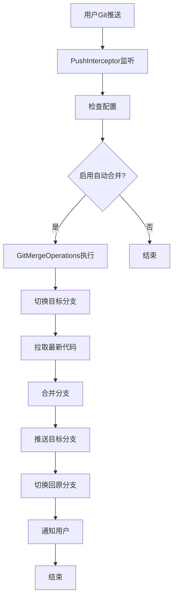
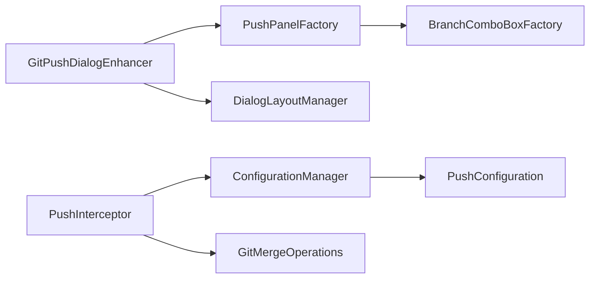

# GitMergeFlow

<div align="center">


**🔀 智能Git分支合并工具 - 让代码合并变得简单高效**

[](https://github.com/yanxianchao/gitmergeflow/stargazers)
[](https://github.com/yanxianchao/gitmergeflow/network)
[](https://github.com/yanxianchao/gitmergeflow/issues)
[](https://github.com/yanxianchao/gitmergeflow/releases)

[🌐 Language / 语言 / 語言](#-语言选择) • [功能特性](#-功能特性) • [快速开始](#-快速开始) • [使用指南](#-使用指南) • [开发文档](#-开发文档) • [贡献指南](#-贡献指南)

</div>

---

## 🌐 语言选择 / Language Selection

| 🇨🇳 简体中文 | 🇺🇸 English |
|-------------|-------------|
| **当前文档** | [English](README.en.md) |

> 💡 **提示**: 您可以在项目根目录找到所有语言版本的文档，或访问 [语言选择页面](README.lang.md) 查看完整列表。

---

## 📖 项目简介

GitMergeFlow 是一款专为 IntelliJ IDEA 设计的智能Git分支合并插件，旨在解决多项目开发环境中的代码同步难题。在传统的开发流程中，多个功能分支需要手动合并到公共分支进行部署，这个过程繁琐且容易出错。

GitMergeFlow 通过在Git推送对话框中集成智能合并功能，实现了**一键式自动合并**，大幅提升了开发效率，减少了人为错误，让开发者能够专注于核心业务逻辑的实现。

### 🎯 解决的核心问题

- **🔄 重复性合并工作**：消除手动合并多个分支到公共分支的重复操作
- **⚡ 部署效率低下**：自动化合并流程，显著缩短代码部署周期
- **🛡️ 合并冲突风险**：智能检测和处理合并冲突，降低代码集成风险
- **📊 多项目协作**：统一合并流程，规范团队开发实践

---

## ✨ 功能特性

### 🚀 核心功能

| 功能 | 描述 | 优势 |
|------|------|------|
| **🤖 智能自动合并** | 推送后自动合并到目标分支 | 无需手动操作，减少人为错误 |
| **🎛️ 可视化配置** | 在推送对话框中直接配置目标分支 | 操作直观，配置简单 |
| **🔀 智能分支检测** | 自动获取可用分支列表 | 避免分支名称错误 |
| **⚡ 快进合并优化** | 优先尝试快进合并，提高效率 | 减少不必要的合并操作 |
| **🔔 实时状态反馈** | 详细的操作结果通知 | 及时了解合并状态 |
| **🛡️ 冲突处理** | 智能检测合并冲突并提示 | 安全可靠的合并流程 |

### 🎨 用户体验

- **🎯 无缝集成**：完美融入IntelliJ IDEA原生Git工作流
- **📱 响应式界面**：适配不同IDEA主题和屏幕尺寸
- **⌨️ 快捷操作**：支持键盘快捷键，提升操作效率
- **🔒 配置持久化**：项目级配置，智能记忆用户偏好

---

## 🚀 快速开始

### 📋 系统要求

| 要求 | 版本 | 说明 |
|------|------|------|
| **IntelliJ IDEA** | 2024.1+ | 支持社区版和旗舰版 |
| **Java** | 17+ | 运行环境要求 |
| **Git** | 2.0+ | 版本控制工具 |
| **操作系统** | Windows/macOS/Linux | 跨平台支持 |

### 💻 安装方式

#### 方式一：手动安装

1. 下载最新版本的插件文件：
   ```bash
   wget https://github.com/yanxianchao/gitmergeflow/releases/latest/download/GitMergeFlow.zip
   ```

2. 在IDEA中安装：
   - `File` → `Settings` → `Plugins` → `⚙️` → `Install Plugin from Disk...`
   - 选择下载的zip文件
   - 重启IDEA

#### 方式二：开发者安装

```bash
# 克隆仓库
git clone https://github.com/yanxianchao/gitmergeflow.git
cd gitmergeflow

# 构建插件
./gradlew build

# 安装到本地IDEA
./gradlew runIde
```

---

## 📖 使用指南

### 🎯 基础使用流程

#### 1. 启用自动合并功能

在Git推送对话框中，您会看到新增的"合并/推送到分支"选项：

```
┌─ Push Commits to origin/feature/user-auth ─────────────────────┐
│                                                               │
│ ☑️ Push commits                                               │
│                                                               │
│ ☑️ 合并/推送到分支： [develop ▼]                                   │
│                                                               │
│                    [ Push ]  [ Cancel ]                      │
└───────────────────────────────────────────────────────────────┘
```

#### 2. 选择目标分支

- 勾选"合并/推送到分支"复选框
- 从下拉列表中选择目标分支（如 `develop`、`staging`、`main`）
- 点击 `Push` 按钮

#### 3. 自动合并执行

插件会自动执行以下操作：


### 🔧 高级功能

#### 快进合并优化

当目标分支没有新提交时，插件会自动使用快进合并：

```bash
# 常规合并（需要切换分支）
git checkout develop
git pull origin develop
git merge feature/user-auth
git push origin develop
git checkout feature/user-auth

# 快进合并（无需切换分支）
git push origin feature/user-auth:develop
```

#### 冲突处理

当检测到合并冲突时，插件会：

1. **停止自动操作**：避免破坏性操作
2. **显示详细提示**：告知用户冲突信息
3. **保持当前状态**：不自动切换分支，便于手动解决

```java
// 冲突提示示例
"合并分支 'feature/user-auth' 到 'develop' 时发生冲突，请手动解决冲突后继续操作"
```

### 📊 配置管理

#### 项目级配置

每个项目的配置独立存储，支持：

- **启用/禁用**：按项目控制自动合并功能
- **目标分支**：为每个项目设置不同的目标分支
- **配置持久化**：重启IDEA后配置保持不变

#### 配置文件位置

```
# IDEA配置目录
~/Library/Application Support/JetBrains/IntelliJIdea2024.1/options/
└── gitmergeflow.xml
```

---

## 🛠️ 开发文档

### 📁 项目结构

```
gitmergeflow/
├───src/
│   └───main/
│       ├───java/
│       │   └───com/github/yanxianchao/gitmergeflow/
│       │       ├───config/          # 配置管理
│       │       │   ├───ConfigurationManager.java
│       │       │   └───PushConfiguration.java
│       │       ├───git/             # Git操作核心
│       │       │   └───GitMergeOperations.java
│       │       ├───launcher/        # 插件启动器
│       │       │   └───GitMergeFlowLauncher.java
│       │       ├───listeners/       # 事件监听器
│       │       │   └───PushInterceptor.java
│       │       ├───ui/              # 用户界面
│       │       │   ├───BranchComboBoxFactory.java
│       │       │   ├───DialogLayoutManager.java
│       │       │   ├───GitPushDialogEnhancer.java
│       │       │   └───PushPanelFactory.java
│       │       └───utils/           # 工具类
│       │           └───ProjectResolver.java
│       └───resources/
│           └───META-INF/
│               └───plugin.xml       # 插件描述文件
├───build.gradle                    # 构建配置
├───gradle.properties              # Gradle属性
└───README.md                      # 项目文档
```

### 🔧 核心架构

#### 事件驱动架构



#### 组件交互



### 🧪 构建与测试

#### 本地开发环境

```bash
# 1. 克隆项目
git clone https://github.com/yanxianchao/gitmergeflow.git
cd gitmergeflow

# 2. 安装依赖
./gradlew build

# 3. 运行测试
./gradlew test

# 4. 启动调试环境
./gradlew runIde
```

#### 构建发布版本

```bash
# 清理构建
./gradlew clean

# 构建插件包
./gradlew buildPlugin

# 生成的插件位置
# build/distributions/GitMergeFlow-1.0.0.zip
```

#### 代码质量检查

```bash
# 代码格式检查
./gradlew ktlintCheck

# 运行所有检查
./gradlew check
```

---

## 🤝 贡献指南

我们欢迎所有形式的贡献！无论是报告bug、提出功能建议，还是提交代码改进。

### 🌟 贡献方式

#### 🐛 报告问题

1. 在 [Issues](https://github.com/yanxianchao/gitmergeflow/issues) 页面创建新问题
2. 使用问题模板，提供详细信息：
   - IDEA版本和操作系统
   - 插件版本
   - 重现步骤
   - 预期行为 vs 实际行为
   - 相关日志或截图

#### 💡 功能建议

1. 在 [Discussions](https://github.com/yanxianchao/gitmergeflow/discussions) 中讨论新功能
2. 详细描述功能需求和使用场景
3. 考虑与其他功能的兼容性

#### 🔧 代码贡献

1. **Fork** 项目到您的GitHub账户
2. **创建** 功能分支：
   ```bash
   git checkout -b feature/amazing-feature
   ```
3. **提交** 您的更改：
   ```bash
   git commit -m 'Add amazing feature'
   ```
4. **推送** 到分支：
   ```bash
   git push origin feature/amazing-feature
   ```
5. **创建** Pull Request

### 📝 开发规范

#### 代码风格

- 遵循 [Google Java Style Guide](https://google.github.io/styleguide/javaguide.html)
- 使用有意义的变量和方法命名
- 添加必要的注释和文档

#### 提交规范

使用 [Conventional Commits](https://www.conventionalcommits.org/) 规范：

```
feat: 添加快进合并功能
fix: 修复分支切换失败问题
docs: 更新README文档
style: 代码格式优化
refactor: 重构配置管理模块
test: 添加Git操作单元测试
chore: 更新依赖版本
```

#### 测试要求

- 新功能必须包含单元测试
- 测试覆盖率不低于80%
- 所有测试必须通过CI检查

---

## 📄 许可证

本项目采用 [MIT License](LICENSE) 开源协议。

```
MIT License

Copyright (c) 2024 yanxianchao

Permission is hereby granted, free of charge, to any person obtaining a copy
of this software and associated documentation files (the "Software"), to deal
in the Software without restriction, including without limitation the rights
to use, copy, modify, merge, publish, distribute, sublicense, and/or sell
copies of the Software, and to permit persons to whom the Software is
furnished to do so, subject to the following conditions:

The above copyright notice and this permission notice shall be included in all
copies or substantial portions of the Software.

THE SOFTWARE IS PROVIDED "AS IS", WITHOUT WARRANTY OF ANY KIND, EXPRESS OR
IMPLIED, INCLUDING BUT NOT LIMITED TO THE WARRANTIES OF MERCHANTABILITY,
FITNESS FOR A PARTICULAR PURPOSE AND NONINFRINGEMENT. IN NO EVENT SHALL THE
AUTHORS OR COPYRIGHT HOLDERS BE LIABLE FOR ANY CLAIM, DAMAGES OR OTHER
LIABILITY, WHETHER IN AN ACTION OF CONTRACT, TORT OR OTHERWISE, ARISING FROM,
OUT OF OR IN CONNECTION WITH THE SOFTWARE OR THE USE OR OTHER DEALINGS IN THE
SOFTWARE.
```

---

## 🙏 致谢

感谢以下项目和贡献者：

- [IntelliJ IDEA](https://www.jetbrains.com/idea/) - 强大的IDE开发环境
- [Git4Idea](https://github.com/JetBrains/intellij-community/tree/master/plugins/git) - Git集成插件
- [Gradle](https://gradle.org/) - 构建工具
- 所有贡献者和用户的支持

---

## 📞 联系我们

- **作者**: yanxianchao
- **邮箱**: xianchao.yan@qq.com
- **GitHub**: [@yanxianchao](https://github.com/yanxianchao)
- **项目主页**: https://github.com/yanxianchao/gitmergeflow

---

<div align="center">

**⭐ 如果这个项目对您有帮助，请给我们一个Star！**

Made with ❤️ by [yanxianchao](https://github.com/yanxianchao)

</div>