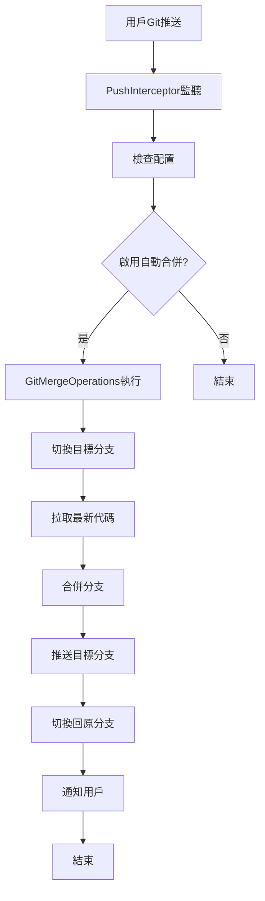
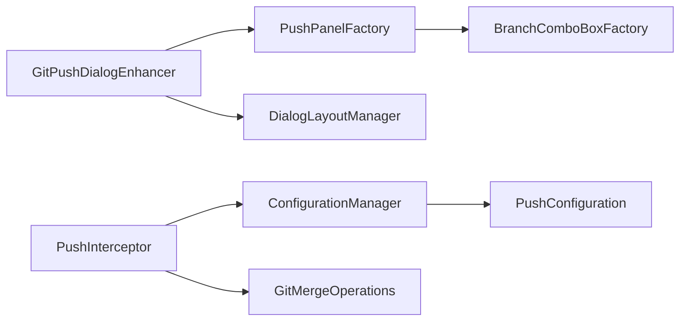

# GitMergeFlow

<div align="center">


**🔀 智能Git分支合併工具 - 讓代碼合併變得簡單高效**

[](https://github.com/yanxianchao/gitmergeflow/stargazers)
[](https://github.com/yanxianchao/gitmergeflow/network)
[](https://github.com/yanxianchao/gitmergeflow/issues)
[](https://github.com/yanxianchao/gitmergeflow/releases)

[🌐 Language / 语言 / 語言](#-語言選擇) • [功能特性](#-功能特性) • [快速開始](#-快速開始) • [使用指南](#-使用指南) • [開發文檔](#-開發文檔) • [貢獻指南](#-貢獻指南)

</div>

---

## 🌐 語言選擇 / Language Selection

| 🇨🇳 简体中文 | 🇹🇼 繁體中文 | 🇺🇸 English |
|-------------|-------------|-------------|
| [简体中文](README.md) | **當前文檔** | [English](README.en.md) |

> 💡 **提示**: 您可以在專案根目錄找到所有語言版本的文檔，或訪問 [語言選擇頁面](README.lang.md) 查看完整列表。

---

## 📖 專案簡介

GitMergeFlow 是一款專為 IntelliJ IDEA 設計的智能Git分支合併插件，旨在解決多專案開發環境中的代碼同步難題。在傳統的開發流程中，多個功能分支需要手動合併到公共分支進行部署，這個過程繁瑣且容易出錯。

GitMergeFlow 透過在Git推送對話框中集成智能合併功能，實現了**一鍵式自動合併**，大幅提升了開發效率，減少了人為錯誤，讓開發者能夠專注於核心業務邏輯的實現。

### 🎯 解決的核心問題

- **🔄 重複性合併工作**：消除手動合併多個分支到公共分支的重複操作
- **⚡ 部署效率低下**：自動化合併流程，顯著縮短代碼部署週期
- **🛡️ 合併衝突風險**：智能檢測和處理合併衝突，降低代碼集成風險
- **📊 多專案協作**：統一合併流程，規範團隊開發實踐

---

## ✨ 功能特性

### 🚀 核心功能

| 功能 | 描述 | 優勢 |
|------|------|------|
| **🤖 智能自動合併** | 推送後自動合併到目標分支 | 無需手動操作，減少人為錯誤 |
| **🎛️ 可視化配置** | 在推送對話框中直接配置目標分支 | 操作直觀，配置簡單 |
| **🔀 智能分支檢測** | 自動獲取可用分支列表 | 避免分支名稱錯誤 |
| **⚡ 快進合併優化** | 優先嘗試快進合併，提高效率 | 減少不必要的合併操作 |
| **🔔 實時狀態反饋** | 詳細的操作結果通知 | 及時了解合併狀態 |
| **🛡️ 衝突處理** | 智能檢測合併衝突並提示 | 安全可靠的合併流程 |

### 🎨 用戶體驗

- **🎯 無縫集成**：完美融入IntelliJ IDEA原生Git工作流
- **📱 響應式界面**：適配不同IDEA主題和屏幕尺寸
- **⌨️ 快捷操作**：支持鍵盤快捷鍵，提升操作效率
- **🔒 配置持久化**：專案級配置，智能記憶用戶偏好

---

## 🚀 快速開始

### 📋 系統要求

| 要求 | 版本 | 說明 |
|------|------|------|
| **IntelliJ IDEA** | 2024.1+ | 支持社區版和旗艦版 |
| **Java** | 17+ | 運行環境要求 |
| **Git** | 2.0+ | 版本控制工具 |
| **作業系統** | Windows/macOS/Linux | 跨平台支持 |

### 💻 安裝方式

#### 方式一：從插件市場安裝（推薦）

1. 打開 IntelliJ IDEA
2. 進入 `File` → `Settings` → `Plugins`
3. 搜尋 "GitMergeFlow"
4. 點擊 `Install` 安裝插件
5. 重啟IDEA

#### 方式二：手動安裝

1. 下載最新版本的插件文件：
   ```bash
   wget https://github.com/yanxianchao/gitmergeflow/releases/latest/download/GitMergeFlow.zip
   ```

2. 在IDEA中安裝：
   - `File` → `Settings` → `Plugins` → `⚙️` → `Install Plugin from Disk...`
   - 選擇下載的zip文件
   - 重啟IDEA

#### 方式三：開發者安裝

```bash
# 克隆倉庫
git clone https://github.com/yanxianchao/gitmergeflow.git
cd gitmergeflow

# 構建插件
./gradlew build

# 安裝到本地IDEA
./gradlew runIde
```

---

## 📖 使用指南

### 🎯 基礎使用流程

#### 1. 啟用自動合併功能

在Git推送對話框中，您會看到新增的"推送到分支"選項：

```
┌─ Push Commits to origin/feature/user-auth ─────────────────────┐
│                                                               │
│ ☑️ Push commits                                               │
│                                                               │
│ ☑️ 推送到分支： [develop ▼]                                   │
│                                                               │
│                    [ Push ]  [ Cancel ]                      │
└───────────────────────────────────────────────────────────────┘
```

#### 2. 選擇目標分支

- 勾選"推送到分支"複選框
- 從下拉列表中選擇目標分支（如 `develop`、`staging`、`main`）
- 點擊 `Push` 按鈕

#### 3. 自動合併執行

插件會自動執行以下操作：


### 🔧 高級功能

#### 快進合併優化

當目標分支沒有新提交時，插件會自動使用快進合併：

```bash
# 常規合併（需要切換分支）
git checkout develop
git pull origin develop
git merge feature/user-auth
git push origin develop
git checkout feature/user-auth

# 快進合併（無需切換分支）
git push origin feature/user-auth:develop
```

#### 衝突處理

當檢測到合併衝突時，插件會：

1. **停止自動操作**：避免破壞性操作
2. **顯示詳細提示**：告知用戶衝突信息
3. **保持當前狀態**：不自動切換分支，便於手動解決

```java
// 衝突提示示例
"合併分支 'feature/user-auth' 到 'develop' 時發生衝突，請手動解決衝突後繼續操作"
```

### 📊 配置管理

#### 專案級配置

每個專案的配置獨立存儲，支持：

- **啟用/禁用**：按專案控制自動合併功能
- **目標分支**：為每個專案設置不同的目標分支
- **配置持久化**：重啟IDEA後配置保持不變

#### 配置文件位置

```
# IDEA配置目錄
~/Library/Application Support/JetBrains/IntelliJIdea2024.1/options/
└── gitmergeflow.xml
```

---

## 🛠️ 開發文檔

### 📁 專案結構

```
gitmergeflow/
├───src/
│   └───main/
│       ├───java/
│       │   └───com/github/yanxianchao/gitmergeflow/
│       │       ├───config/          # 配置管理
│       │       │   ├───ConfigurationManager.java
│       │       │   └───PushConfiguration.java
│       │       ├───git/             # Git操作核心
│       │       │   └───GitMergeOperations.java
│       │       ├───launcher/        # 插件啟動器
│       │       │   └───GitMergeFlowLauncher.java
│       │       ├───listeners/       # 事件監聽器
│       │       │   └───PushInterceptor.java
│       │       ├───ui/              # 用戶界面
│       │       │   ├───BranchComboBoxFactory.java
│       │       │   ├───DialogLayoutManager.java
│       │       │   ├───GitPushDialogEnhancer.java
│       │       │   └───PushPanelFactory.java
│       │       └───utils/           # 工具類
│       │           └───ProjectResolver.java
│       └───resources/
│           └───META-INF/
│               └───plugin.xml       # 插件描述文件
├───build.gradle                    # 構建配置
├───gradle.properties              # Gradle屬性
└───README.md                      # 專案文檔
```

### 🔧 核心架構

#### 事件驅動架構



#### 組件交互



### 🧪 構建與測試

#### 本地開發環境

```bash
# 1. 克隆專案
git clone https://github.com/yanxianchao/gitmergeflow.git
cd gitmergeflow

# 2. 安裝依賴
./gradlew build

# 3. 運行測試
./gradlew test

# 4. 啟動調試環境
./gradlew runIde
```

#### 構建發布版本

```bash
# 清理構建
./gradlew clean

# 構建插件包
./gradlew buildPlugin

# 生成的插件位置
# build/distributions/GitMergeFlow-1.0.0.zip
```

#### 代碼質量檢查

```bash
# 代碼格式檢查
./gradlew ktlintCheck

# 運行所有檢查
./gradlew check
```

---

## 🤝 貢獻指南

我們歡迎所有形式的貢獻！無論是報告bug、提出功能建議，還是提交代碼改進。

### 🌟 貢獻方式

#### 🐛 報告問題

1. 在 [Issues](https://github.com/yanxianchao/gitmergeflow/issues) 頁面創建新問題
2. 使用問題模板，提供詳細信息：
   - IDEA版本和作業系統
   - 插件版本
   - 重現步驟
   - 預期行為 vs 實際行為
   - 相關日誌或截圖

#### 💡 功能建議

1. 在 [Discussions](https://github.com/yanxianchao/gitmergeflow/discussions) 中討論新功能
2. 詳細描述功能需求和使用場景
3. 考慮與其他功能的兼容性

#### 🔧 代碼貢獻

1. **Fork** 專案到您的GitHub賬戶
2. **創建** 功能分支：
   ```bash
   git checkout -b feature/amazing-feature
   ```
3. **提交** 您的更改：
   ```bash
   git commit -m 'Add amazing feature'
   ```
4. **推送** 到分支：
   ```bash
   git push origin feature/amazing-feature
   ```
5. **創建** Pull Request

### 📝 開發規範

#### 代碼風格

- 遵循 [Google Java Style Guide](https://google.github.io/styleguide/javaguide.html)
- 使用有意義的變數和方法命名
- 添加必要的註釋和文檔

#### 提交規範

使用 [Conventional Commits](https://www.conventionalcommits.org/) 規範：

```
feat: 添加快進合併功能
fix: 修復分支切換失敗問題
docs: 更新README文檔
style: 代碼格式優化
refactor: 重構配置管理模塊
test: 添加Git操作單元測試
chore: 更新依賴版本
```

#### 測試要求

- 新功能必須包含單元測試
- 測試覆蓋率不低於80%
- 所有測試必須通過CI檢查

---

## 📄 許可證

本專案採用 [MIT License](LICENSE) 開源協議。

```
MIT License

Copyright (c) 2024 yanxianchao

Permission is hereby granted, free of charge, to any person obtaining a copy
of this software and associated documentation files (the "Software"), to deal
in the Software without restriction, including without limitation the rights
to use, copy, modify, merge, publish, distribute, sublicense, and/or sell
copies of the Software, and to permit persons to whom the Software is
furnished to do so, subject to the following conditions:

The above copyright notice and this permission notice shall be included in all
copies or substantial portions of the Software.

THE SOFTWARE IS PROVIDED "AS IS", WITHOUT WARRANTY OF ANY KIND, EXPRESS OR
IMPLIED, INCLUDING BUT NOT LIMITED TO THE WARRANTIES OF MERCHANTABILITY,
FITNESS FOR A PARTICULAR PURPOSE AND NONINFRINGEMENT. IN NO EVENT SHALL THE
AUTHORS OR COPYRIGHT HOLDERS BE LIABLE FOR ANY CLAIM, DAMAGES OR OTHER
LIABILITY, WHETHER IN AN ACTION OF CONTRACT, TORT OR OTHERWISE, ARISING FROM,
OUT OF OR IN CONNECTION WITH THE SOFTWARE OR THE USE OR OTHER DEALINGS IN THE
SOFTWARE.
```

---

## 🙏 致謝

感謝以下專案和貢獻者：

- [IntelliJ IDEA](https://www.jetbrains.com/idea/) - 強大的IDE開發環境
- [Git4Idea](https://github.com/JetBrains/intellij-community/tree/master/plugins/git) - Git集成插件
- [Gradle](https://gradle.org/) - 構建工具
- 所有貢獻者和用戶的支持

---

## 📞 聯繫我們

- **作者**: yanxianchao
- **郵箱**: xianchao.yan@qq.com
- **GitHub**: [@yanxianchao](https://github.com/yanxianchao)
- **專案主頁**: https://github.com/yanxianchao/gitmergeflow

---

<div align="center">

**⭐ 如果這個專案對您有幫助，請給我們一個Star！**

Made with ❤️ by [yanxianchao](https://github.com/yanxianchao)

</div>